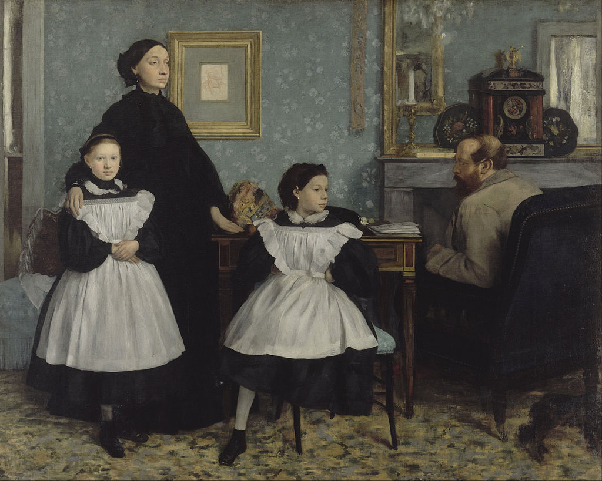

# Vancouver Modern: on the limits of portraiture #

The logic of portraiture shifts in accordance with the various demands placed upon it. What is portraiture allowed or not allowed to say? What is portraiture allowed or not allowed to do? Here, the very meaning of the genre becomes dependent on the context of its production and reproduction which shape both how it is received and understood. 

*The Bellelli Family*, by Edgar Degas (1834-1917), housed in the collection of the Musée d'Orsay, is a masterpiece of 19th century portraiture. No evaluation of the work can rest solely on verisimilitude or characterization alone, both popular criteria for success in the genre and determinants to which the genre is often reduced. Does anyone really care now whether Guilia Bellelli looked like that? Nor can the image’s merit be ascribed to the author’s sensitive observation and description of a failed marriage. Witness the bleak chasm between Laura and Gennaro Bellelli and how Gennaro sits with his back to his family and us. Rather, observation and description are outperformed here by reflection and critique. Look. Look at Degas' purposeful positioning of Giulia into the centre of the canvas, posed in such a way as to appear both wilful and defiant (i.e., seated unladylike with left foot tucked up under her body, arms akimbo). Through figure, pose, and placement, the author imagines a force with the potential to exceed the state of affairs within which she exists.

 

*Edgar Degas, The Bellelli Family, 1858-1867, Oil on canvas, 200 x 253 cm, Musée d'Orsay, Paris, France*

Degas exhibited *The Bellelli Family* only once in his lifetime, in the Paris Salon of 1867. The painting was found after the author’s death rolled up in a corner of his studio. Why this unhappy fate? Was the picture withdrawn because the author realized he had left his cousins too exposed and vulnerable in his pictorial assessment of them and their predicament? It takes an imperturbable being to sit before a master portraitist. Or were Degas’s observations and reflections on family life of the 19th century French haute bourgeoisie too unsettling for his contemporaries? Even today, public critique of societal conventions are assumed by many to undermine social stability.

Regardless, the point here is that portraiture at its most significant has a discursive character capable of the deepest philosophical engagement and enquiry. Whether that character can be fully identified, understood, and/or appreciated at the point of a portrait’s reception, well…that’s another matter.

The nine works making up this exhibition are grounded in the context of a specific time and place: the neighbourhoods comprising downtown Vancouver at the end of the twentieth century. 
All of the images were inspired by events that either I witnessed personally over my thirty plus years living here or were inspired by the stories of life in Vancouver told to me by my neighbours. 

From one perspective, this exhibition is documentary, capturing in visual format the ephemeral, what is slipping away of the past consequent to the radical transformation of the city. 

From another, the exhibition is retrospective. I continue to make pictures. Reviewing these works in sequence allows me to uncover competing philosophical trajectories. What I asked of the genre in the earliest works was to have portraiture ‘say’ and ‘do’ social critique. Over time, another philosophical course gradually emerged, a move to social anthropology, particularly a contemplation on the meaning and psychology of the nuclear family: *Sisters (1996)* and *Sister and Brother (2001)*. What else can I say but that the move from an analysis of a public space rife with social discord to an analysis of a private space where individuals find a way to hold each other dear is not a bad thing.

K Madill: Vancouver, British Columbia, December 2020

## Browse the Exhibition


